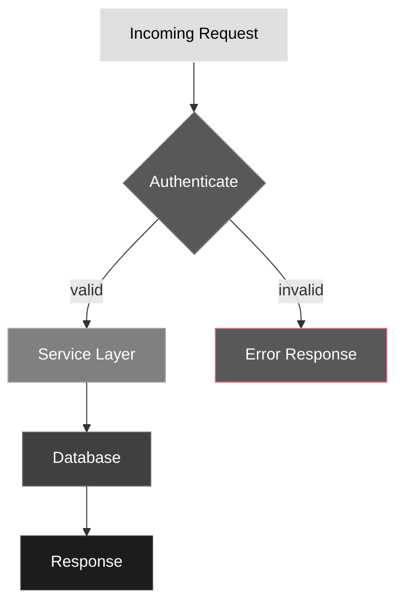

# Mermaid Style Guide

Syntax rules, styling conventions, and reference palettes for Mermaid diagrams. Mermaid is text — it diffs and gets updated like code. For when and how to use diagrams, see `framework/guides/diagrams.md`.

______________________________________________________________________

## Why Styling Rules Exist

Mermaid's default styling varies across rendering contexts — GitHub light mode, dark mode, docs sites, and IDE previews all produce different results. An unstyled diagram that looks fine in your editor may be unreadable on GitHub dark mode.

These rules exist to guarantee two things:

1. **Legibility** — every label is readable on every background
1. **Consistency** — diagrams across the project look like they belong together

Without explicit styling, you get diagrams where some nodes are invisible on dark backgrounds, accent colors clash with fills, and every author invents their own color scheme.

______________________________________________________________________

## Contrast and Legibility

These are non-negotiable — every other styling decision flows from them.

| Rule | Why | In practice |
|---|---|---|
| Text readable on its background | WCAG AA minimum (4.5:1 contrast ratio) | Light text on dark fills, dark text on light fills |
| Adjacent nodes visually distinguishable | Readers need to tell roles apart at a glance | If two tiers look the same, adjust or merge them |
| Accent colors legible against their fill | Strokes disappear on similar-toned fills | Test accents on both your lightest and darkest fills |
| Nodes explicitly styled | Mermaid defaults aren't guaranteed legible | Every `graph`/`flowchart` node gets a `style` declaration |
| Tested on actual render target | Contrast calculators help but aren't sufficient | Verify on GitHub light/dark, your docs site, IDE preview |

**Test:** Take a screenshot of your diagram on the target background. Can you read every label and distinguish every tier without squinting? If not, fix the contrast.

______________________________________________________________________

## Styling Approach

### Role-Based Tiers

Assign fills by **what a node does**, not where it sits in the graph. A grayscale gradient ensures diagrams read well in both color and monochrome contexts.

Define 5-7 tiers covering common node roles:

| Tier | Role | Description | When to use |
|------|------|-------------|-------------|
| 1 | Input / entry | Lightest | Where data or flow begins — API requests, user actions, triggers |
| 2 | Phase / section | Light | Grouping or stage labels — subgraph titles, pipeline phases |
| 3 | Transform / action | Mid-light | Processing steps — services, handlers, transformations |
| 4 | Decision / control flow | Mid | Branching points — auth checks, conditionals, routing |
| 5 | Output / result | Mid-dark | Where data ends up — responses, stored results, published events |
| 6 | Annotation / secondary | Dark | Supporting info — metadata, logging, monitoring |
| 7 | Terminal / endpoint | Darkest | Final state — system boundaries, external services, dead ends |

The specific fill, stroke, and text color values depend on your rendering background. See the reference palettes below.

### How to pick a tier

```
What does this node represent?

Is it where the flow starts?
├─ Yes → Tier 1 (Input)
└─ No
   ├─ Is it a grouping label or phase? → Tier 2 (Phase)
   ├─ Does it process or transform data? → Tier 3 (Transform)
   ├─ Does it branch or make a decision? → Tier 4 (Decision)
   ├─ Is it a result or output? → Tier 5 (Output)
   ├─ Is it supplementary / metadata? → Tier 6 (Annotation)
   └─ Is it a terminal state or external boundary? → Tier 7 (Terminal)
```

**When the role is ambiguous:** Pick the closest functional equivalent and apply that tier consistently across all similar nodes in the diagram. Consistency within a diagram matters more than perfect tier assignment.

### Accent Colors

Most diagrams should be grayscale-only. Reach for accents when:

- A node represents a failure state or error path that the reader needs to spot immediately
- You need to distinguish a semantic category (success/warning/error) that the tier system can't express — tiers encode *role*, accents encode *status*
- A specific node is the point of the diagram and needs to stand out from its peers

If none of these apply, stay grayscale. A diagram where every node has an accent color is a diagram where nothing stands out.

Apply accents as **stroke-only** on top of the base tier fill. This preserves grayscale readability while adding meaning.

| Rule | Why |
|---|---|
| Never use accents as fill colors | They clash with text legibility across themes |
| Assign by semantic role first | Error = red-ish, success = green-ish, warning = amber-ish |
| When no role fits, pick from fixed priority order | Keeps diagrams consistent across the project |
| Keep accent usage under ~30% of nodes | More than that and the emphasis is lost — everything is "important" |

**Priority order for non-semantic accents:** When you need N accent colors and no semantic role fits, take the first N from the palette's accent table. This prevents every diagram from inventing its own color assignments.

### Semantic Role Rules

These prevent the most common styling mistakes:

| Rule | Violation example | Why it's wrong |
|---|---|---|
| Decision diamonds `{...}` always use tier 4 | Diamond styled as error (red stroke) | Conflates control flow with failure state |
| Sibling nodes of the same role share the same tier | Two services, one tier 3, one tier 5 | Implies one service is more important |
| Never mix fill and stroke from different tiers | Tier 1 fill + tier 5 stroke (accents excepted) | Creates a visual Frankenstein — neither tier reads correctly |
| Subgraph backgrounds use your receding tier | Subgraph with tier 1 (bright) background | Foreground nodes get lost against the subgraph |
| Highlights override tier style entirely | Half the diagram highlighted | Use sparingly — max ~20-30% of nodes |

______________________________________________________________________

## Reference Palettes

Starting points — adapt to your project's rendering context. Both palettes are designed so that text on every fill meets WCAG AA contrast (4.5:1 minimum).

### Dark background (e.g., `#0d1117`)

Text flips from dark to light between tiers 2 and 3.

| Tier | Role | `style` declaration |
|------|------|---------------------|
| 1 | Input / entry | `fill:#e0e0e0,stroke:#ffffff,color:#000000` |
| 2 | Phase / section | `fill:#b0b0b0,stroke:#d0d0d0,color:#000000` |
| 3 | Transform / action | `fill:#808080,stroke:#a8a8a8,color:#ffffff` |
| 4 | Decision / control flow | `fill:#585858,stroke:#888888,color:#ffffff` |
| 5 | Output / result | `fill:#404040,stroke:#686868,color:#ffffff` |
| 6 | Annotation / secondary | `fill:#282828,stroke:#484848,color:#ffffff` |
| 7 | Terminal / endpoint | `fill:#1c1c1c,stroke:#383838,color:#ffffff` |

**Accent strokes (dark background):**

| Priority | Role | Stroke color | Example |
|----------|------|-------------|---------|
| 1 | Error / dead-end | `#f7768e` | `fill:#585858,stroke:#f7768e,color:#ffffff` |
| 2 | Warning / highlighted | `#e0af68` | `fill:#585858,stroke:#e0af68,color:#ffffff` |
| 3 | Success / positive | `#9ece6a` | `fill:#585858,stroke:#9ece6a,color:#ffffff` |
| 4 | Info / in-progress | `#7aa2f7` | `fill:#585858,stroke:#7aa2f7,color:#ffffff` |

**`sequenceDiagram` rect blocks** — only mid-range tiers work as region backgrounds. Too light washes out node fills; too dark blends with the canvas.

| Tier | `rect rgb(...)` | Why this range |
|------|-----------------|----------------|
| 4 | `rect rgb(88, 88, 88)` | Dark enough to group, light enough to see node fills |
| 5 | `rect rgb(64, 64, 64)` | Mid-range — good default for most regions |
| 6 | `rect rgb(40, 40, 40)` | Barely visible — use for subtle background grouping |

Tiers 1-3 are too light (wash out node fills). Tier 7 is too close to the `#0d1117` canvas.

### Light background (e.g., `#ffffff`)

Text flips from dark to light between tiers 5 and 6.

| Tier | Role | `style` declaration |
|------|------|---------------------|
| 1 | Input / entry | `fill:#f5f5f5,stroke:#d0d0d0,color:#1a1a1a` |
| 2 | Phase / section | `fill:#e0e0e0,stroke:#b8b8b8,color:#1a1a1a` |
| 3 | Transform / action | `fill:#c0c0c0,stroke:#999999,color:#1a1a1a` |
| 4 | Decision / control flow | `fill:#999999,stroke:#777777,color:#1a1a1a` |
| 5 | Output / result | `fill:#6a6a6a,stroke:#505050,color:#1a1a1a` |
| 6 | Annotation / secondary | `fill:#404040,stroke:#2a2a2a,color:#ffffff` |
| 7 | Terminal / endpoint | `fill:#1a1a1a,stroke:#000000,color:#ffffff` |

**Accent strokes (light background):** Use darker, more saturated variants so they're visible against lighter fills.

| Priority | Role | Stroke color | Example |
|----------|------|-------------|---------|
| 1 | Error / dead-end | `#d32f2f` | `fill:#999999,stroke:#d32f2f,color:#1a1a1a` |
| 2 | Warning / highlighted | `#f57f17` | `fill:#999999,stroke:#f57f17,color:#1a1a1a` |
| 3 | Success / positive | `#388e3c` | `fill:#999999,stroke:#388e3c,color:#1a1a1a` |
| 4 | Info / in-progress | `#1565c0` | `fill:#999999,stroke:#1565c0,color:#1a1a1a` |

**`sequenceDiagram` rect blocks (light background):**

| Tier | `rect rgb(...)` | Why this range |
|------|-----------------|----------------|
| 1 | `rect rgb(245, 245, 245)` | Barely visible — subtle grouping |
| 2 | `rect rgb(224, 224, 224)` | Mid-range — good default |
| 3 | `rect rgb(192, 192, 192)` | Darkest usable — any darker competes with node fills |

### Choosing a palette

| Situation | Approach |
|---|---|
| Docs render on **one known background** | Pick that palette, use it consistently everywhere |
| Docs render on **both light and dark** (e.g., GitHub) | Prefer `theme: 'neutral'` with minimal `style` overrides — it adapts better than hardcoded fills. Only override when contrast is insufficient |
| Unsure about rendering context | Start with the dark palette (more common failure mode), verify on light |

______________________________________________________________________

## Syntax Rules

### `graph` / `flowchart`

| Rule | Right | Wrong | Why |
|---|---|---|---|
| Style every node | `style req fill:#e0e0e0,...` | (no style declaration) | Unstyled nodes inherit unpredictable defaults |
| Line breaks in labels | `["Line 1<br/>Line 2"]` | `["Line 1\nLine 2"]` | `\n` renders as literal text |
| Edge labels | `-->\|label text\|` | `-->"label text"` | Quoted labels render with poor contrast |
| Edge styling | (use defaults) | `linkStyle 0 stroke:red` | Only override when a specific edge needs semantic emphasis |
| Subgraph fill | `style sg fill:#282828,...` | (unstyled subgraph) | Some renderers make unstyled subgraphs invisible or garish |

### `sequenceDiagram`

| Rule | Right | Wrong | Why |
|---|---|---|---|
| Background regions | `rect rgb(88, 88, 88)` | `rect rgb(255, 0, 0)` | Use palette values only — accent colors distract from interactions |
| Return arrows | `B->>A: response` (direct caller) | `B->>Client: response` (chain originator) | Return goes to whoever sent the most recent request |
| Participant declaration | `participant API as API Gateway` | (implicit participants) | Explicit blocks prevent ambiguous return targets |

### `classDiagram`

| Rule | Right | Wrong | Why |
|---|---|---|---|
| Separator | (just list members) | `---` inside class body | Invalid syntax — Mermaid throws a parse error |
| Field syntax | `+name : type` | `+type name` | First token after `+` is treated as the member name |
| Method syntax | `+methodName(paramType) ReturnType` | `+methodName(paramType) : ReturnType` | `:` is for fields only — methods use space before return type |

### `erDiagram`, `stateDiagram-v2`

No custom fill styling needed — Mermaid's theme defaults work well for these diagram types. Keep relationship labels concise (1-3 words).

______________________________________________________________________

## Examples

### Flowchart (dark background)

Shows tier assignment by role and accent usage for the error path:



**Why each tier:**

| Node | Tier | Reasoning |
|------|------|-----------|
| `req` | 1 (Input) | Where the flow begins |
| `auth` | 4 (Decision) | Branching point — diamond shape confirms |
| `svc` | 3 (Transform) | Processes the request |
| `db` | 5 (Output) | Where data gets stored/retrieved |
| `res` | 7 (Terminal) | Final state — end of the flow |
| `err` | 4 + error accent | Decision-tier fill (same role context) with red stroke for failure |

### Sequence diagram (dark background)

Shows `rect` usage for grouping and explicit participant declaration:

```mermaid
sequenceDiagram
    participant C as Client
    participant A as API Gateway
    participant S as Order Service
    participant D as Database

    C->>A: POST /orders
    rect rgb(88, 88, 88)
        Note over A,S: Authentication
        A->>A: Validate token
    end
    A->>S: CreateOrder(payload)
    rect rgb(64, 64, 64)
        Note over S,D: Persistence
        S->>D: INSERT order
        D->>S: order_id
    end
    S->>A: OrderCreated(order_id)
    A->>C: 201 {data: order}
```



**Why these choices:**

- Explicit `participant` blocks with aliases keep the diagram readable
- `rect` groups the auth and persistence phases without accent colors
- Return arrows go to the direct caller (`D->>S`, not `D->>C`)

______________________________________________________________________

## Common Mistakes

| Mistake | What goes wrong | Fix |
|---|---|---|
| **No `style` declarations** | Nodes invisible or illegible on some backgrounds | Add explicit `style` for every node in `graph`/`flowchart` |
| **Accent as fill color** | `fill:#f7768e` — text unreadable on saturated fill | Use accent as stroke only: `fill:#585858,stroke:#f7768e` |
| **`\n` in labels** | Literal `\n` text appears in the rendered node | Use `<br/>` inside `["..."]` labels |
| **Quoted edge labels** | `-->"label"` renders with poor contrast | Use `-->\|label\|` without quotes |
| **Mixed tier fills on same-role nodes** | Two services styled differently — implies hierarchy | Same role = same tier, always |
| **Off-palette colors** | `fill:#3a7bd5` — breaks project consistency | Use only palette-defined values |
| **Bright subgraph background** | Foreground nodes lost against the subgraph | Use tier 6 or 7 for subgraph fills |
| **`---` in classDiagram** | Parse error — diagram doesn't render | Remove separators; just list members sequentially |
| **Return to chain originator** | `DB->>Client` instead of `DB->>Service` | Return arrow goes to the direct caller |
| **`rect` with accent colors** | Bright red/green backgrounds distract from the interactions | Use only grayscale palette `rect` values |

______________________________________________________________________

## Verification

Not every diagram needs the same level of verification. Match the effort to the risk:

| Situation | Verification needed |
|---|---|
| Simple 3-5 node flowchart, single background | Quick visual check in your editor's preview |
| Complex diagram (10+ nodes, accents, subgraphs) | Render in Mermaid Live Editor, check all tiers and accents |
| Docs render on both light and dark backgrounds | Verify on **both** — this is where most legibility failures hide |
| First diagram in a new project or new palette | Full verification: screenshot, contrast check, peer review |

Preview by pasting into the [Mermaid Live Editor](https://mermaid.live), or embed in an HTML file with your target background color.

### Checklist

Before committing a Mermaid diagram:

1. Does every node in a `graph`/`flowchart` have an explicit `style` declaration?
1. Is text legible on every node — no low-contrast labels?
1. Are adjacent nodes of different tiers visually distinguishable?
1. Are accent colors stroke-only (never fill)?
1. Do accent-stroked nodes have a visible colored border?
1. Are all colors from the project palette (no off-palette values)?
1. Do same-role nodes share the same tier?
1. No `\n` rendered as literal text in any label?
1. Do `sequenceDiagram` return arrows go to the direct caller?
1. If docs support theme switching, verified on **both** light and dark backgrounds?
