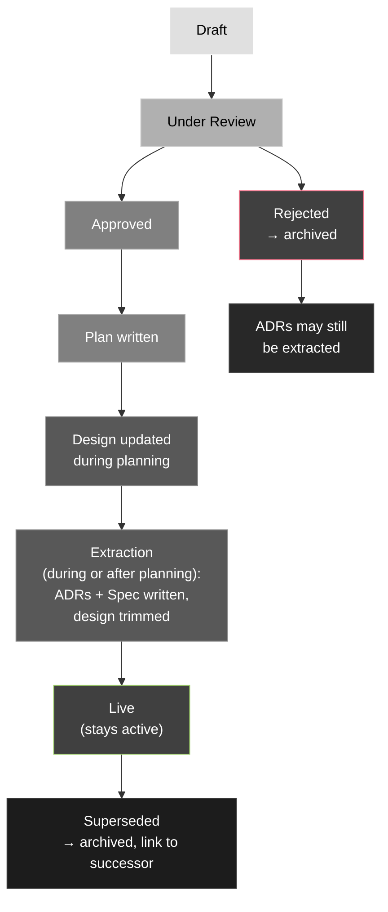

# Writing Design Docs

How to write, approve, and maintain design docs — the pre-approval artifact that captures
the full context of a problem, alternatives considered, and a recommendation. Read this
when proposing a non-trivial change that needs agreement before implementation begins. For
the focused decisions extracted from an approved design, see
`framework/guides/writing-decision-records.md`. For exhaustive behavioural detail, see
`framework/guides/writing-specs.md`.

---

## What a design doc is

A design doc serves one overarching goal by answering multiple questions: what problem are
we solving, what did we consider, what are we doing, and why. The core of every design doc
is **the problem** — if that isn't clear, nothing else in the document matters.

**Design docs change shape over their lifecycle.** A proposed design is intentionally fat:
full alternatives, detailed trade-off analysis, open questions — because reviewers need all
of that to evaluate the approach. After approval, a plan is written and execution begins.
As extraction happens (ADRs for decisions with wider impact, specs for exhaustive detail),
the design is trimmed of content that now lives elsewhere. The live design that remains is
lean: problem, options, reasoning, links to artifacts. Fat at proposal; lean after
extraction. Both are correct for their phase.

**Design doc, not ADR.** An ADR answers one question with one answer, plus the context
and constraints that made it non-obvious. A design doc serves a broader goal and may
contain several such decisions — some worth extracting to ADRs, some not. ADRs are
extracted from designs; they are not the design itself.

**Design doc, not spec.** A spec goes into exhaustive depth on a solution: exact formats,
every case, every constraint. A design doc frames the problem and justifies the approach.
Spec-level detail belongs in the spec, not in the design.

**Design doc, not plan.** A plan is a file-level execution checklist. It follows from the
design; it does not replace it.

---

## When to write one

Write a design doc when:

- A change touches multiple components or requires non-obvious trade-offs
- Reasonable people might disagree about the right approach
- The cost of course-correcting mid-implementation is high
- Explicit approval is needed before work begins

Don't write one when:

- The approach is obvious and the change is small — just write the plan
- A relevant decision is already recorded in an ADR — reference it

---

## Lifecycle



**At Draft / Under Review: fat is correct.** A proposed design carries full context —
detailed alternatives, trade-off analysis, resolved and unresolved open questions — because
that context is what reviewers need. Do not trim a proposed design.

**Approval unlocks planning.** Write a plan immediately after approval. The design may be
updated during planning as implementation details become clearer.

**Extraction happens during or after planning** — not as a precondition to it. As the
plan is written or executed, extract ADRs for decisions with wider impact and write specs
for solutions that need exhaustive detail. Trim the design of content that now lives
elsewhere; it remains live as the lasting record of the problem and reasoning.

**After extraction: lean is correct.** The trimmed design should be readable as a
narrative — problem, options, reasoning, links to artifacts. It should not be a table of
contents, and it should not retain spec-level detail that now lives in a spec.

**An approved design that is still long** is a housekeeping signal: extraction may not
have happened yet, not a quality failure in the document itself.

**Archive only on deprecation or rejection** — move to `docs/archive/designs/`. Do not
archive after the plan ships. The design stays live as long as the system it describes is
active.

---

## Format

Use when writing a new design doc — copy this skeleton and fill in each section.

```markdown
# [Feature or Change] Design

> **Phase: Draft**
> _Change to: Under Review → Approved → Live (post-extraction) → Superseded / Rejected_

**Date:** YYYY-MM-DD
**Author:** [name or role]

[1–2 sentences: the problem being solved and which system or component is affected.]

---

## Problem

What is broken, missing, or needs to change? What constraints exist (performance,
compatibility, team capacity)? Write from the perspective of the current state — no
solution yet. This section is the core of the document; if it isn't clear, nothing else
lands.

## Alternatives considered

### Option A: [Name]

What it is, how it works at a high level.

**Pros:** what gets easier, what risk it avoids
**Cons:** what gets harder, what it costs, what doors it closes

### Option B: [Name]

...

## Recommendation

**Recommended: Option [X]**

Why this option over the others. Compare directly against the alternatives — explain what
tips the scales, not just what the winner is. One or two paragraphs.

## Open questions

<!--
Format each question as:
- **[Question]** Options considered: A, B, C. User response: [brief]. Resolution: [answer] — or _Pending_.
Strike through the entire entry when resolved; don't delete it.
-->

- **[Question]** Options considered: ... User response: ... Resolution: _Pending_.

## Out of scope

What this design explicitly does not address. Prevents scope creep and documents
deliberate omissions.

## Extracted artifacts

Populated after approval — links to ADRs and specs extracted from this design.

- ADR: [title](link)
- Spec: [title](link)
```

---

## Section-by-section guidance

### Problem

This is the most important section. State the problem as it exists today — not the
solution, not the decision to be made. Constraints that aren't visible from the codebase
(operational complexity, team size, timeline, prior commitments) belong here. A reader
should understand why this question is being asked at all.

**Bad:** "We need to decide whether to use file-based agent handoff."
**Good:** "Audit agents share context directly, which prevents parallelism and grows the
orchestrator's window with every document processed."

If the problem section is vague, stop and fix it before writing anything else.

### Alternatives considered

Every design doc must include this section. A recommendation without alternatives is an
assertion, not a design. Alternatives should be options that were genuinely on the table
— not strawmen that were never seriously considered, and not options made to look obviously
wrong. If they were obviously wrong, they weren't real alternatives.

Each alternative: what it is, honest pros, honest cons. Be as hard on the winner as on
the losers. If the recommended option has no cons, you haven't thought it through.

### Recommendation

Compare directly against the named alternatives. "Option A over Option B because X" is
useful. "Option A is best" is not.

If the call was close, say so. The deciding factor — even a soft one like team familiarity
or operational simplicity — is worth naming. False certainty makes the document less
trustworthy.

### Open questions

Write these during drafting; don't wait until review. Record every question as it arises
— including questions surfaced in conversation with the user before or during writing.

Each entry uses a consistent format:

```
- **[Question]** Options considered: A, B, C. User response: [brief]. Resolution: [answer].
```

- **Options considered** — the alternatives that were on the table for this question,
  even informally. If there was only one obvious path, say so.
- **User response** — a brief note of what the user said when the question was raised,
  if applicable. Not a transcript; a one-line summary.
- **Resolution** — the answer reached. If still open, write `_Pending_`.

Strike through the entire entry when resolved — do not delete it. The history of what was
asked, what was considered, and how it was resolved is part of the design's value.

**When to add an entry:** Any time a question is raised — in the conversation, during
drafting, or discovered while writing alternatives — add it immediately. Do not wait for
the answer. Mark it `_Pending_`; fill in the resolution when it arrives.

---

## After approval: planning and extraction

Approval means the approach is agreed on. The next step is always a plan — not extraction.

**Write a plan** that references the design (and any spec, once written) and tracks
implementation file by file. The plan is ephemeral; the design is not. See the Ephemeral
bucket in `framework/managing-project-information.md`.

**Update the design during planning** if implementation reveals details that change the
approach. The design doc reflects what was agreed; keep it current as understanding
evolves. Do not treat it as frozen at approval.

**Extract ADRs** as part of or after planning — when the decisions have been confirmed
through implementation, not before. Extract for decisions with wider impact: choices
others might need to apply consistently, that a future contributor might reverse without
knowing the reasoning, or that shape how related decisions should be made elsewhere. An
ADR answers one question with one answer. Not every decision in a design warrants one:
minor decisions, narrowly scoped choices, and decisions unlikely to recur can stay in the
design. See `framework/guides/writing-decision-records.md`.

**Write a spec** as part of or after planning — once the approach is confirmed and the
exhaustive detail is known. The design framed the problem and justified the approach; the
spec goes to full depth on how it works. See `framework/guides/writing-specs.md`.

**Trim the design** after extraction by replacing extracted content with links to the
ADRs and specs. Record the links in the Extracted artifacts section. The design should
remain readable as a narrative — problem, options, reasoning — not become a table of
contents.

---

## Archiving, deprecating, and rejecting

### Deprecation

Deprecate a design when the system it describes has been replaced or the approach has been
superseded by a different design.

1. Update the design's Status to `Deprecated — superseded by [link to successor]`
2. Scan for decisions worth extracting to ADRs before archiving — the reasoning behind
   the original approach may still be valuable even if the approach is gone
3. Move to `docs/archive/designs/`
4. Do not delete — the design is a historical record of the problem as it was understood
   and the reasoning that led to the original approach

### Rejection

Reject a design when it was evaluated and not adopted — a proposed or under-review design
that was declined.

1. Update the Status to `Rejected`
2. Add a brief note explaining why it was rejected (1–2 sentences is enough)
3. Scan for decisions worth extracting — deciding not to do something is still a decision.
   If the rejection reasoning is non-obvious and might affect future proposals, write an
   ADR before archiving
4. Move to `docs/archive/designs/`
5. Do not delete

### What does NOT trigger archival

- The plan ships. Design docs outlive plans — the design is the lasting record of the
  problem and reasoning; the plan was the execution artifact.
- The system evolves incrementally. Update the live design doc instead of replacing it;
  archive only when the design is fundamentally superseded.

---

## Naming and placement

```
docs/designs/<slug>.md
```

- Slug-only filename — design docs are living documents; a date prefix would make a
  current, active design look like a historical artifact (same reasoning as specs,
  see ADR 003)
- Lowercase hyphen-separated slug describing the change or feature, not the outcome
- Live designs stay in `docs/designs/`; deprecated or rejected designs move to
  `docs/archive/designs/` — don't delete them, rejected designs may still yield ADRs
  (deciding not to do something is a decision worth keeping)

---

## Common mistakes

| Mistake                                             | Fix                                                                                                                    |
| --------------------------------------------------- | ---------------------------------------------------------------------------------------------------------------------- |
| Problem section is vague or missing                 | Rewrite before anything else — if the problem isn't clear, the rest of the document can't be evaluated                 |
| No alternatives section                             | Add at least two real options with honest pros/cons                                                                    |
| Recommendation doesn't compare against alternatives | Rewrite to name what tips the scales                                                                                   |
| Cons omitted for the recommended option             | Add the real costs — every option has them                                                                             |
| Proposed design trimmed prematurely                 | Fat is correct at proposal phase — do not trim until after approval and extraction                                     |
| Open questions not recorded until review            | Add questions as they arise during drafting; mark `_Pending_`, fill in resolution when it arrives                      |
| User responses to questions not captured            | Record the brief response inline in the question entry — it is part of the design's reasoning                          |
| Phase not visible at a glance                       | Update the Phase blockquote at the top of the doc whenever status changes                                              |
| Design is still very long after plan ships          | Check whether extraction has happened — if not, extract ADRs and write the spec, then trim                             |
| Design archived after plan ships                    | Don't archive on plan completion — keep live; archive only on deprecation or rejection                                 |
| ADRs extracted for every decision in the design     | Reserve ADRs for decisions with wider impact or reuse potential; minor or narrowly scoped decisions stay in the design |
| Design doc used as spec                             | Write a separate spec; the design frames and justifies, the spec specifies exhaustively                                |
| Rejected design deleted                             | Archive instead — the decision not to do something is still a decision worth keeping                                   |
